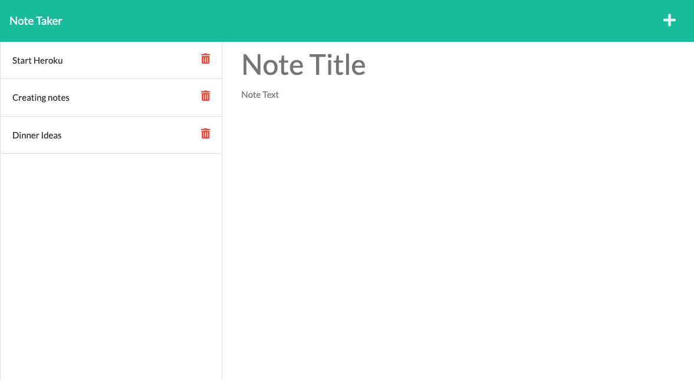

# 11-Node.js_NoteTaker
Unit 11 Challenge is creating a note taker in node.js

## Project Description
This project is to create a note taker in node.js.  You can create, save, view, edit and delete notes.  

## Table of Contents
- [Project Description](#project-description)
- [Utilize Project](#utilize-project)
- [Screenshot](#Screenshot)
- [Video Links](#video-links)
- [Credits](#Credits)
- [License](#License)
- [Links](#links)

## Utilize Project
To run this project open up the integrated terminal.  Run node server.js to open up the local host 3001.  You can open up the site, click on the "Get Started" button.  This will open the notes url.  You may enter in a note title and note text, then the save button will appear.  You may save your note and view the tile on the left hand column.  Click on the note title and you can see and edit your note again.  I used the express, file system and util modules. 

## Screenshot

## Video Link
[Video Link]()

## Credits
I utilized Unit 11 Module 28 Mini-Project.  I had a lot of fantastic help from the classmates on Discord.

## License
There is no license for this project

## Links
- [Github](https://github.com/CanRo2B)
- [Portfolio](https://canro2b.github.io/Portfolio/)
- [Email](mailto:hofe36@hotmail.com)